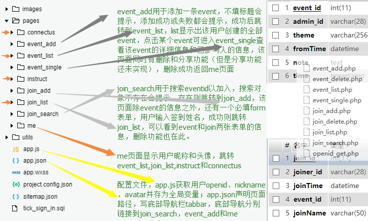
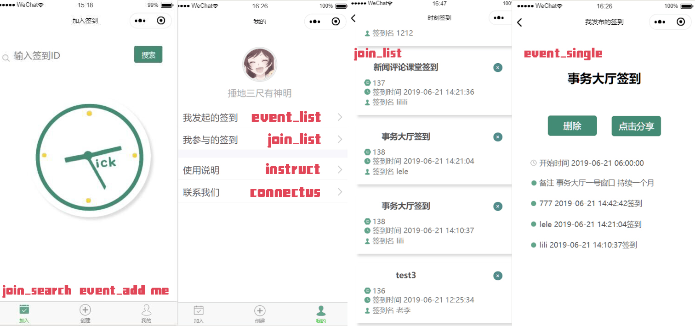

readme

#### 一·项目简介

时刻签到（tick-sign-in），微信签到小程序，可实现活动的发布、删除、查看（活动信息及加入者）；及活动的加入、删除、查看。

#### 二·技术说明

##### 前端

wxss调样式和css几乎没有区别，wxml中变量用{{x}}来表示，其中x要在同名js中data声明。js的工作是从wxml获取数据并传给php让php插入数据库，让php在数据库找数据返回给自己，再给wxml。大致的逻辑是用户——wxml——js——php——database，其中，php和database在服务器，wxml和js在微信开发者工具。

##### 后台

~~腾讯云开发（弃用）~~：wafer2解决方案，跟着官方demo在controller下进行开发，缺点是直接云开发每次更新都要上传才能测试，与本地开发的兼容性差（php语句是封装好的，而且是面向对象的，访问路由也很奇特）。

phpstudy：在本地进行开发，域名为http://localhost

腾讯云服务器+域名+宝塔面板：购买学生优惠的腾讯云服务器（上海），根据腾讯的官方文档部署环境总是出错，用神器宝塔面板稍微容易一些；在国内购买域名需要一个月备案，因此在国外us domain center购买，但是解析比较慢，使用dnspod解析

#### 三·文件结构说明及前端

##### 文件结构说明

pages内每个文件夹里都有四个同名不同格式文件：x.wxml x.wxss x.json x.js其中起功能作用的是wxml和js。

本项目pages中文件夹主要分三个模块：event（深灰箭头）、join（浅灰箭头）和me（橙色箭头），前两个是功能：add、read、delete，me则是展示

明黄色箭头指向的则是配置文件

右边是数据库中的两张表（上event，下joins）及php文件，命名意义和前端类似，不赘述

##### 前端

随便放几个页面出来

#### 四·开发团队

禾兑兑  乐童童  小明

三人均为新闻传播学院大三下在读，上了一学期HTML、CSS、简单的JS；一学期PHP，MySQL；半学期PHP面向对象和设计模式，再花半学期开发了这个小程序。采取同时劳动、主责接力棒分工模式，分工图如下。

| 时间             | 禾兑兑                     | 乐童童                                                      | 小明                                                         | tick                                                         |
| ---------------- | -------------------------- | ----------------------------------------------------------- | ------------------------------------------------------------ | ------------------------------------------------------------ |
| 5.11-5.17   预热 | 撰写计划书                 | 尝试安装环境                                                |                                                              |                                                              |
| 5.18-5.31   开始 | 用wxml和wxss完成十余个页面 | 找demo和源码                                                | 尝试腾讯云wafer2方案开发，可以连接数据库并进行操作           | 有了完整的静态页面                                           |
| 6.1-6.16  进击   | 设计logo及页面风格         | 通过phpstudy本地开发，改demo源码，找到一个计院老乡帮忙debug | 协助乐童童debug                                              | 能通过微信开发者工具在本地创建event，在event下创建join       |
| 6.16-6.21  高潮  | 调CSS样式，设计            | 调CSS样式，设计                                             | 优化小程序，艰难探索后在高中同学的指点下部署云服务器、购买域名 | 能获取用户openid、nickname、avatar并插入表单，设置模态框和跳转优化用户体验 |

其中，放上开发密度最大的ddl前5天

|      | 数据库修改                                                   | 进度                                                         | 展望                                                         |
| ---- | ------------------------------------------------------------ | ------------------------------------------------------------ | ------------------------------------------------------------ |
| 0617 | 修改了user、event（原admin）、joins的表单结构，以及做好删除表单conn的准备 | 可以获取openid并引用，但还不灵活（创建join时event_id无法写入，创建event时fromTime和toTime写入错误） | 向joins和event表输入admin_id和joiner_id，并在“我的”这里实现选择性查看而非显示全部数据；如果有可能实现定时签到功能 |
| 0618 | 删除了表单conn                                               | 可以获取openid并存入数据库，同时通过getuserinfo获取头像、昵称并显示在前端；向joins和event表输入admin_id和joiner_id，并在“我的”这里实现选择性查看而非显示全部数据；点开event显示单条数据和joiner列表（half） | 点开event显示单条数据和joiner列表（点击button获取id）；实现event的删除、编辑功能；实现定时签到功能；兼容上传云开发；把join_list和event_list显示的信息调整并区别化 |
| 0619 | 在event和join之间建立了外键约束                              | 点开event显示单条数据和joiner列表；实现event和join的删除功能；把join_list和event_list显示的信息调整并区别化 | 实现定时签到功能；兼容上传云开发                             |
| 0620 | 删除event表单中的totime，删除user表单                        | 上午：优化用户体验，放弃定时签到；放弃云开发。这天的剩下时间：购买腾讯云服务器、域名，在服务器部署PHP和MySQL，晚上使用dnspod解析替换掉国外的解析服务器 | 说是0-72小时，希望早点解析好；尝试分享签到                   |
| 0621 |                                                              | 线上部署测试；尝试实现分享签到功能，可以携带数据分享，但无法完成签到，百度未果，估计是没上线的原因 | 希望不要出bug                                                |

#### 五·展望

该小程序已经有了最基本的功能，后期可以增加许多功能，比如签到设置有效时间；分享签到；在event上设主题；扫码、地点签到，但是这些都需要时间，需要不断踩坑和尝试，但也会有不断的进步。

总的来说，敲代码的确需要理解，需要一个系统的知识体系，但是也需要经验，需要不断地实践。